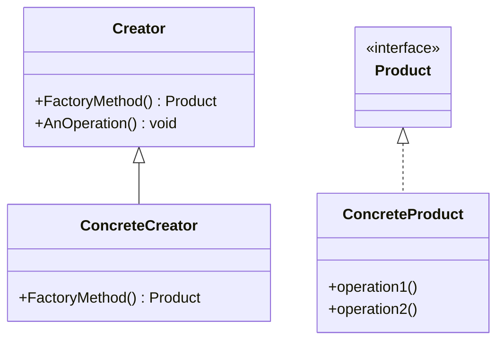
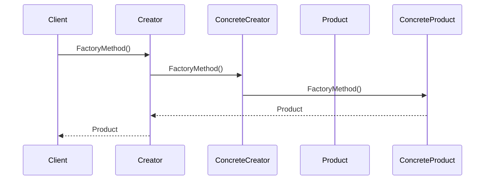
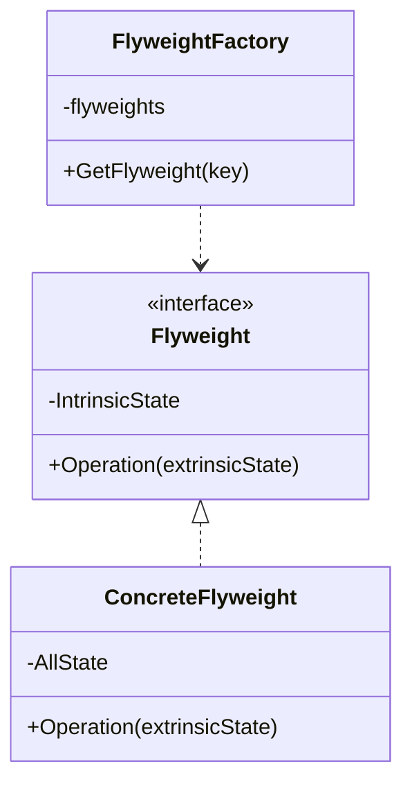
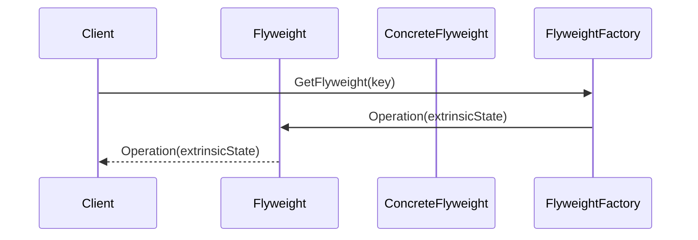
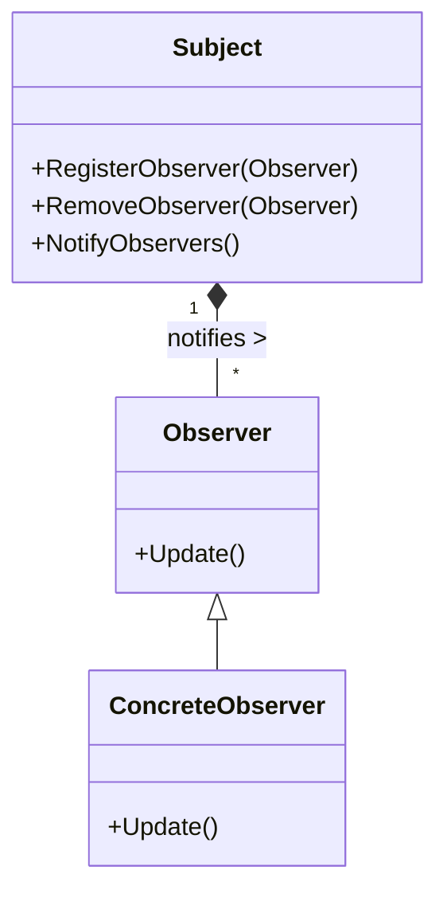
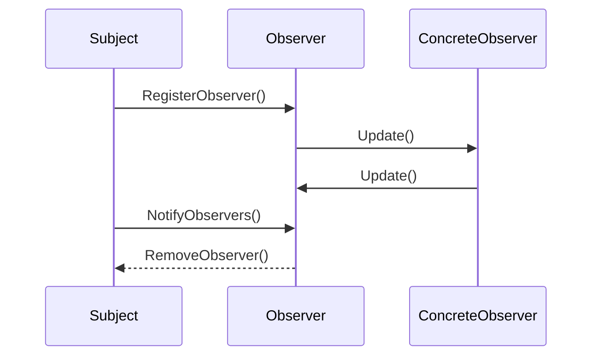
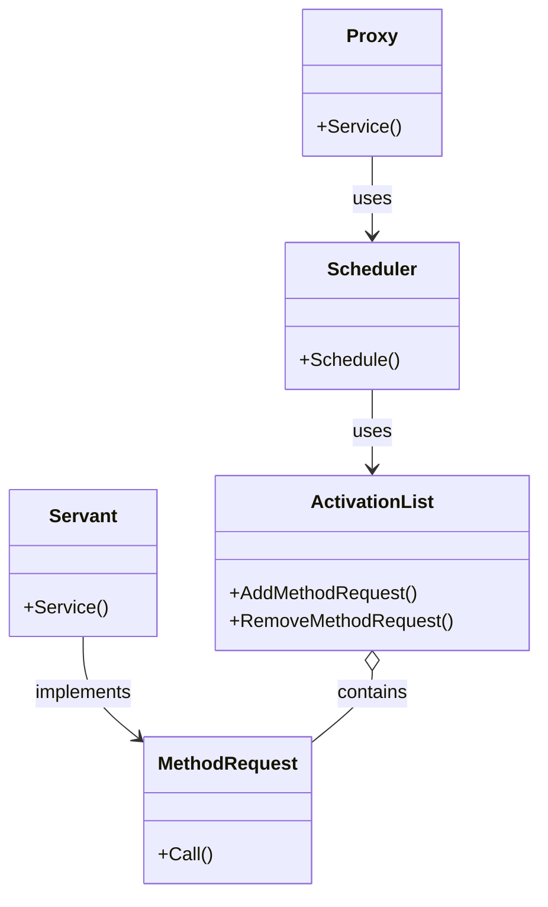
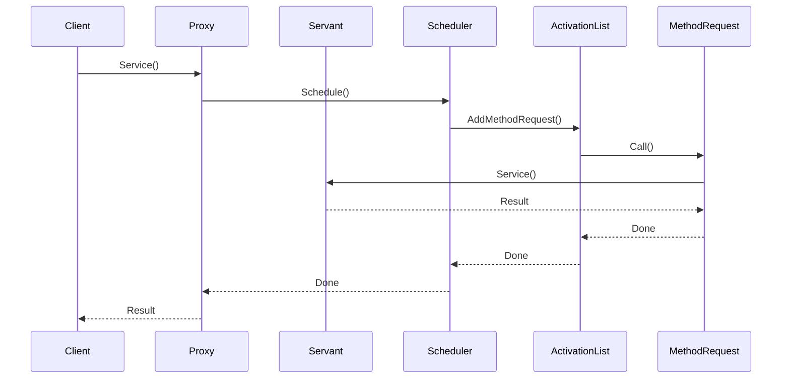

# aasd_design_patterns

# Factory Method

**Призначення та застосування:** Factory Method – це твірний патерн проектування, який використовується для створення об'єктів. Він дозволяє класу відкласти створення екземплярів підкласам, які можуть вирішувати, який саме клас створювати. Цей патерн особливо корисний, коли клас не може передбачити клас об'єктів, які йому потрібно створити, або коли клас хоче, щоб його підкласи визначали об'єкти, які він створює.

**Опис:** У паттерні Factory Method для створення об'єкта визначається інтерфейс, але вибір, який саме клас інстанціювати, залишається за підкласами. Це забезпечує більшу гнучкість і розділення коду.

**UML діаграма класів Factory Method**

**UML діаграма взаємодії Factory Method**

**Основні структурні елементи:** 
- **Product:** Інтерфейс для створюваних об'єктів.
- **Concrete Product:** Реалізація інтерфейсу продукту.
- **Creator:** Абстрактний клас, який оголошує фабричний метод.
- **Concrete Creator:** Підклас Creator, який реалізує фабричний метод для створення конкретного продукту Concrete Product.

**Джерела:**
1. [geeksforgeeks.org - Factory Method Design Pattern in Java](https://www.geeksforgeeks.org/factory-method-design-pattern-in-java/)
2. [Wikipedia - Factory method pattern](https://en.wikipedia.org/wiki/Factory_method_pattern)

# Flyweight

**Призначення та застосування:** Flyweight – це структурний патерн дизайну, який мінімізує використання пам'яті за рахунок спільного використання якомога більшої кількості даних з іншими схожими об'єктами. Його часто використовують, коли потрібно створити велику кількість об'єктів, а зберігати кожен з них окремо непрактично через брак пам'яті.

**Опис:** Об'єкти Flyweight є незмінними, вони не можуть бути змінені після створення. Шаблон використовує фабрику для управління об'єктами і повторно використовує існуючі екземпляри, передаючи зовнішні дані, коли це необхідно.

**UML діаграма класів Flyweight**

**UML діаграма взаємодії Flyweight**

**Основні структурні елементи:** 
- **Flyweight:** Інтерфейс, за допомогою якого Flyweight може отримувати зовнішній стан та здійснювати операції над ним.
- **Concrete Flyweight:** Реалізує інтерфейс Flyweight і зберігає внутрішній стан.
- **Flyweight Factory:** Керує об'єктами Flyweight та створює їх за потреби.

**Джерела:**
1. [geeksforgeeks.org - Flyweight Design Pattern](https://www.geeksforgeeks.org/flyweight-design-pattern/)
2. [Wikipedia - Flyweight pattern](https://en.wikipedia.org/wiki/Flyweight_pattern)

# Observer

**Призначення та застосування:** Observer – це поведінковий патерн проектування, який визначає залежність "один-до-багатьох" між об'єктами таким чином, що коли один об'єкт змінює стан, всі його залежні об'єкти отримують сповіщення та оновлюються автоматично. Він використовується для реалізації розподілених систем обробки подій, таких як архітектурний патерн "model-view-controller" (MVC).

**Опис:** Патерн Observer включає в себе об'єкт і декількох спостерігачів. Спостерігачі підписуються на об’єкт і отримують повідомлення про зміни стану, що спонукає їх оновлюватись відповідно.

**UML діаграма класів Observer**

**UML діаграма взаємодії Observer**

**Основні структурні елементи:** 
- **Subject:** Веде список спостерігачів та повідомляє їх про зміни.
- **Observer:** Надає інтерфейс оновлення для об'єктів, які мають бути сповіщені про зміни суб'єкта.
- **Concrete Observer:** Реалізує інтерфейс спостерігача і визначає, як оновити себе на основі змін суб'єкта.

**Джерела:**
1. [geeksforgeeks.org - Observer Pattern Set 1: Introduction](https://www.geeksforgeeks.org/observer-pattern-set-1-introduction/)
2. [Wikipedia - Observer pattern](https://en.wikipedia.org/wiki/Observer_pattern)

# Active Object

**Призначення та застосування:** Active Object – це патерн паралельного проектування, який відокремлює виконання методу від його виклику, дозволяючи методам працювати в окремих потоках. Він використовується для асинхронної обробки операцій, покращуючи швидкість відгуку та масштабованість у паралельних системах.

**Опис:** Активні об'єкти містять механізм виклику методів, планувальник для обробки запитів та окремий потік для виконання методів.

**UML діаграма класів Active Object**

**UML діаграма взаємодії Active Object**

**Основні структурні елементи:** 
- **Proxy:** Надає клієнтам інтерфейс для надсилання запитів.
- **Servant:** Об'єкт, який містить бізнес-логіку.
- **Scheduler:** Визначає порядок і час виконання запитів.
- **Activation List:** Зберігає запити, що очікують на виконання.
- **Method Request:** Являє собою запит на виконання операції.

**Джерела:**
1. [java-design-patterns.com - Active Object](https://java-design-patterns.com/patterns/active-object/)
2. [Wikipedia - Active object](https://en.wikipedia.org/wiki/Active_object)
