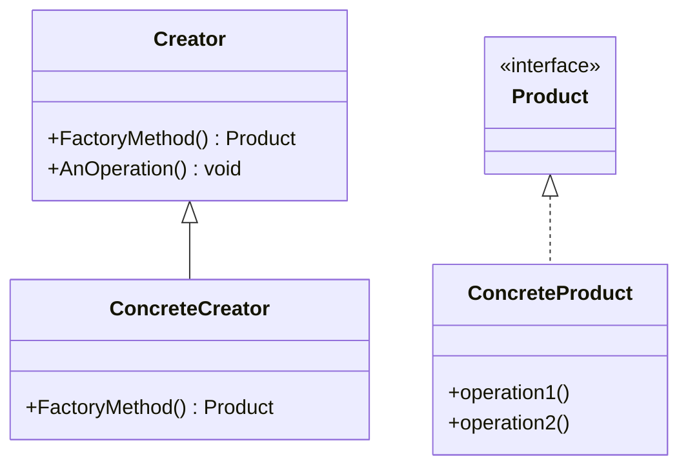
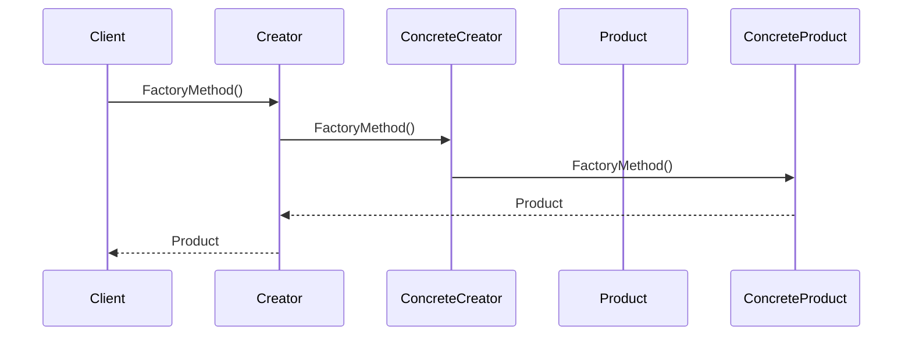
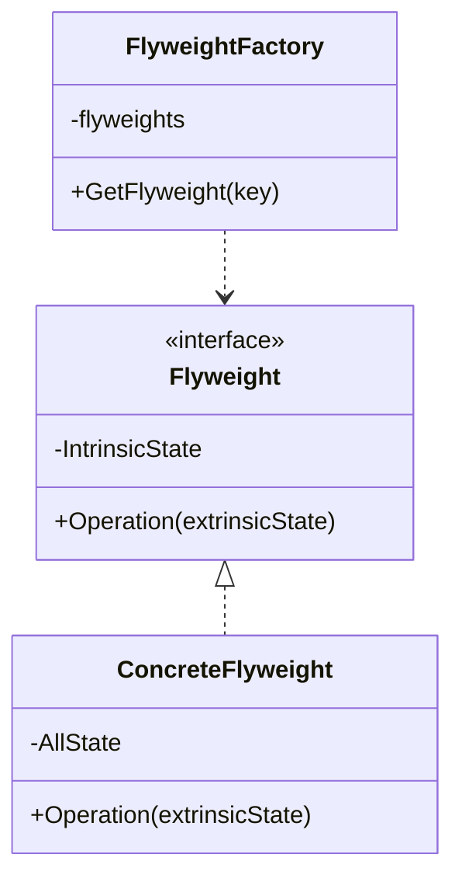
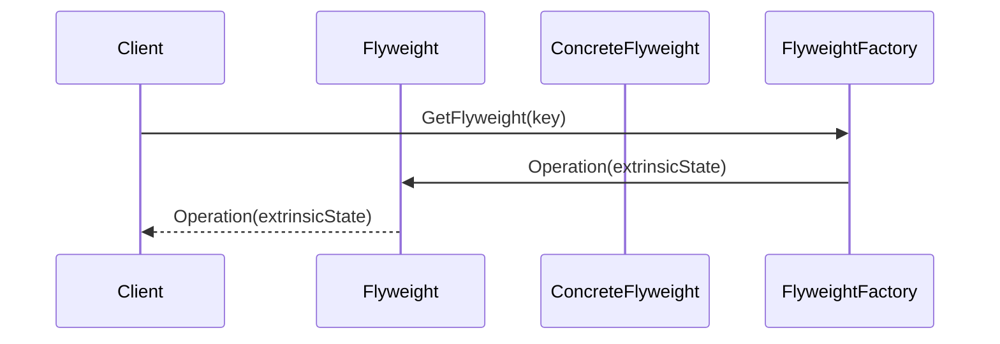
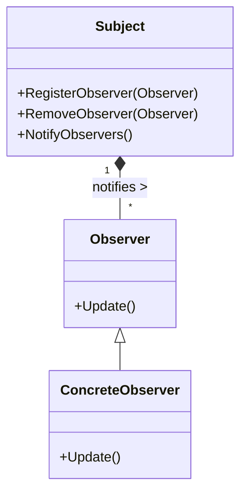
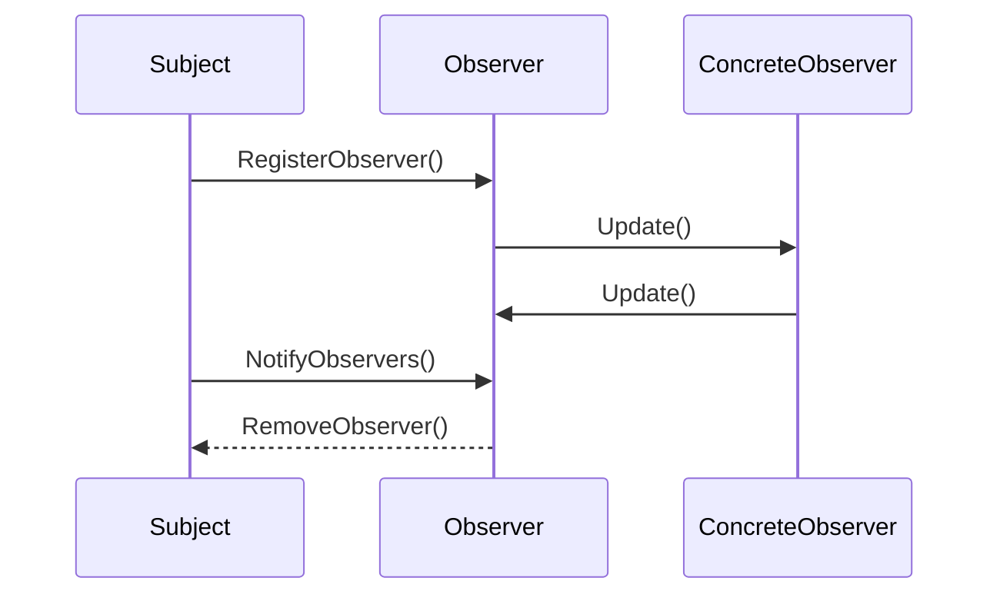
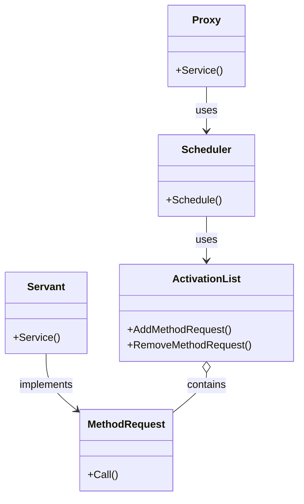
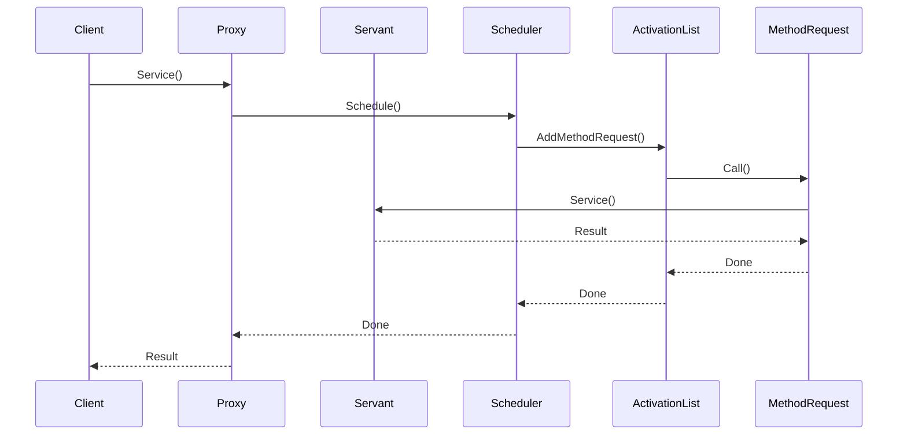

# aasd_design_patterns

```mermaid
classDiagram
      Creator <|-- ConcreteCreator
      Product <|.. ConcreteProduct
      
      class Creator {
          +FactoryMethod() Product
          +AnOperation() void
      }
      
      class ConcreteCreator {
          +FactoryMethod() Product
      }
      
      class Product {
          <<interface>>
      }
      
      class ConcreteProduct {
          +operation1()
          +operation2()
      }
```

```mermaid
sequenceDiagram
    participant Client
    participant Creator
    participant ConcreteCreator
    participant Product
    participant ConcreteProduct
    
    Client->>Creator: FactoryMethod()
    Creator->>ConcreteCreator: FactoryMethod()
    ConcreteCreator->>ConcreteProduct: FactoryMethod()
    ConcreteProduct-->>Creator: Product
    Creator-->>Client: Product
```

```mermaid
classDiagram
      Flyweight <|.. ConcreteFlyweight
      FlyweightFactory ..> Flyweight
      class Flyweight{
          <<interface>>
          -IntrinsicState
          +Operation(extrinsicState)
      }
      class ConcreteFlyweight{
          -AllState
          +Operation(extrinsicState)
      }
      class FlyweightFactory{
          -flyweights
          +GetFlyweight(key)
      }
```

```mermaid
sequenceDiagram
    participant Client
    participant Flyweight
    participant ConcreteFlyweight
    participant FlyweightFactory
    
    Client->>FlyweightFactory: GetFlyweight(key)
    FlyweightFactory->>Flyweight: Operation(extrinsicState)
    Flyweight-->>Client: Operation(extrinsicState)
```

```mermaid
classDiagram
  class Subject {
    +RegisterObserver(Observer)
    +RemoveObserver(Observer)
    +NotifyObservers()
  }
  class Observer {
    +Update()
  }
  class ConcreteObserver {
    +Update()
  }
  Subject "1" *-- "*" Observer : notifies >
  Observer <|-- ConcreteObserver
```

```mermaid
sequenceDiagram
    participant Subject
    participant Observer
    participant ConcreteObserver

    Subject->>Observer: RegisterObserver()
    Observer->>ConcreteObserver: Update()
    ConcreteObserver->>Observer: Update()
    Subject->>Observer: NotifyObservers()
    Observer-->>Subject: RemoveObserver()
```

```mermaid
classDiagram
class Proxy {
  +Service()
}

class Servant {
  +Service()
}

class MethodRequest {
  +Call()
}

class Scheduler {
  +Schedule()
}

class ActivationList {
  +AddMethodRequest()
  +RemoveMethodRequest()
}

Proxy --> Scheduler : uses
Servant --> MethodRequest : implements
Scheduler --> ActivationList : uses
ActivationList o-- MethodRequest : contains
```

```mermaid
sequenceDiagram
    participant Client
    participant Proxy
    participant Servant
    participant Scheduler
    participant ActivationList
    participant MethodRequest
    
    Client->>Proxy: Service()
    Proxy->>Scheduler: Schedule()
    Scheduler->>ActivationList: AddMethodRequest()
    ActivationList->>MethodRequest: Call()
    MethodRequest->>Servant: Service()
    Servant-->>MethodRequest: Result
    MethodRequest-->>ActivationList: Done
    ActivationList-->>Scheduler: Done
    Scheduler-->>Proxy: Done
    Proxy-->>Client: Result
```
