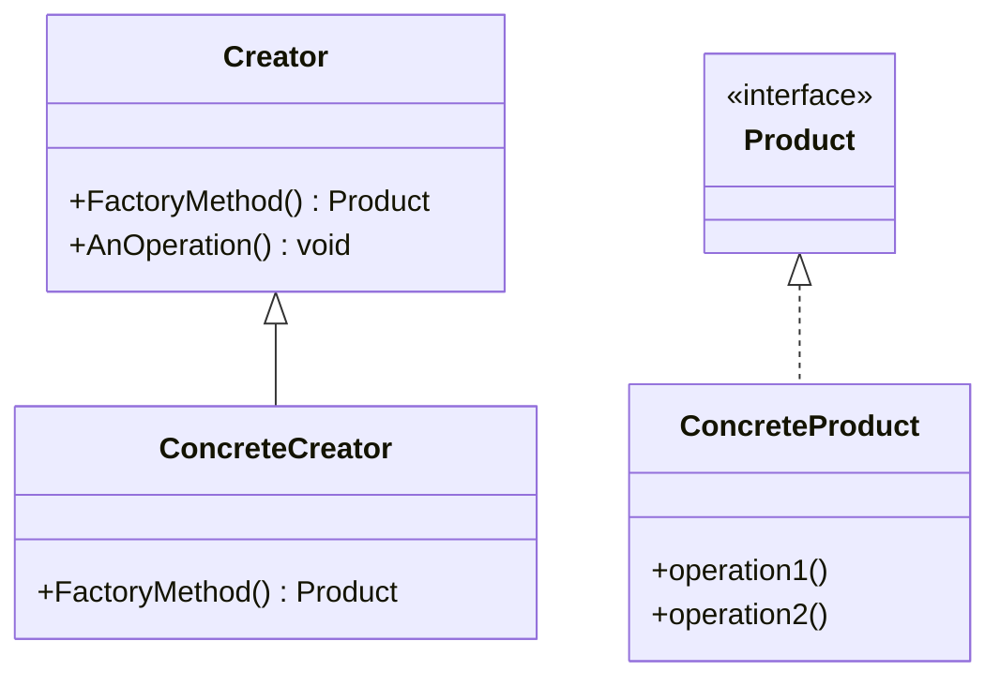
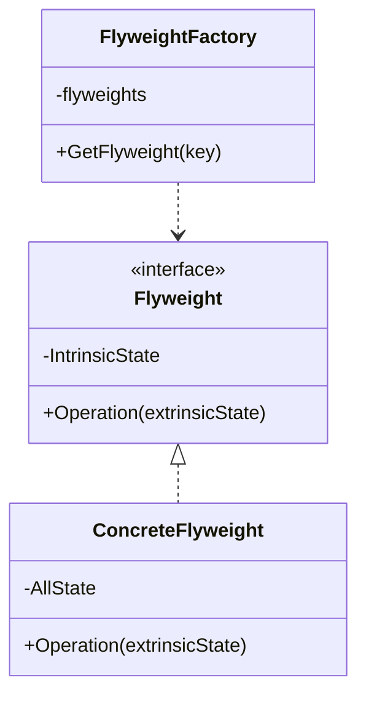

# aasd_design_patterns

```mermaid
classDiagram
      Creator <|-- ConcreteCreator
      Product <|.. ConcreteProduct
      
      class Creator {
          +FactoryMethod() Product
          +AnOperation() void
      }
      
      class ConcreteCreator {
          +FactoryMethod() Product
      }
      
      class Product {
          <<interface>>
      }
      
      class ConcreteProduct {
          +operation1()
          +operation2()
      }
```

```mermaid
classDiagram
      Flyweight <|.. ConcreteFlyweight
      FlyweightFactory ..> Flyweight
      class Flyweight{
          <<interface>>
          -IntrinsicState
          +Operation(extrinsicState)
      }
      class ConcreteFlyweight{
          -AllState
          +Operation(extrinsicState)
      }
      class FlyweightFactory{
          -flyweights
          +GetFlyweight(key)
      }
```
